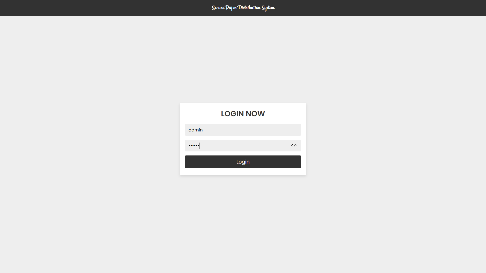
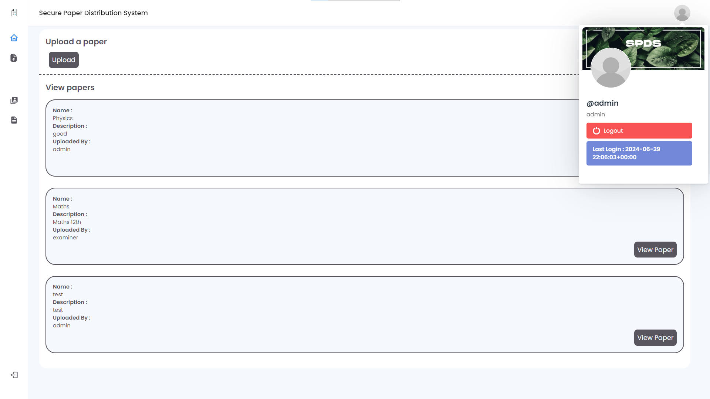
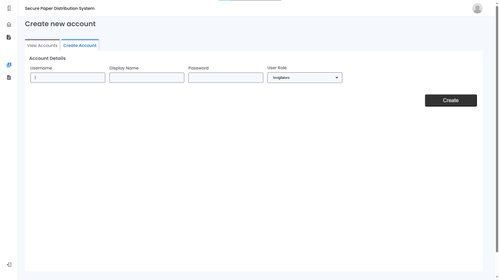
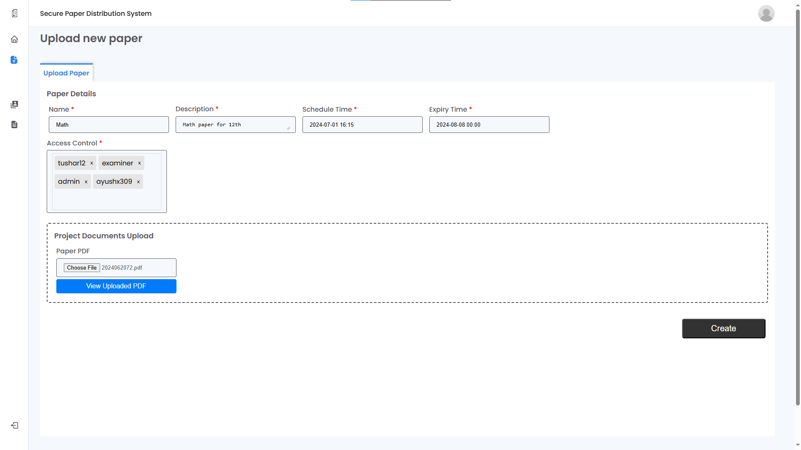
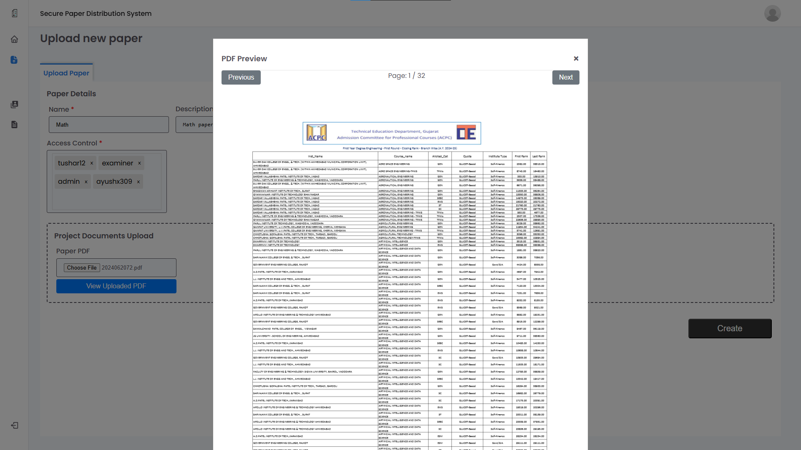
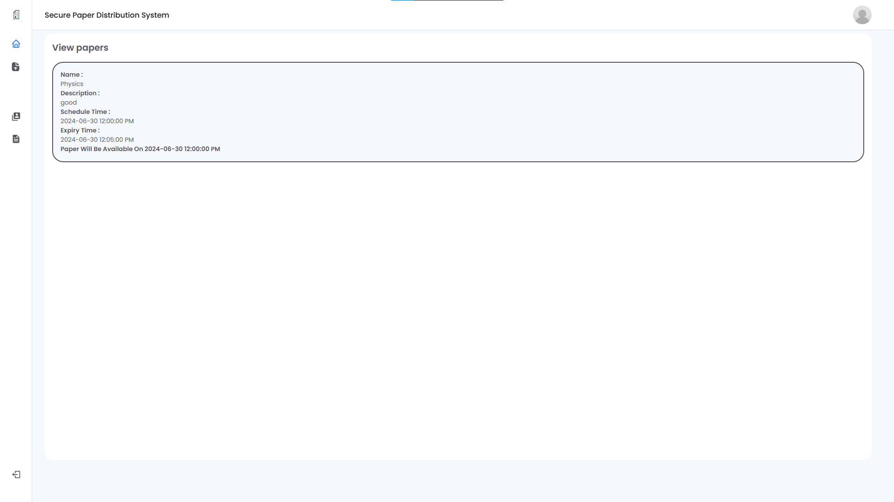
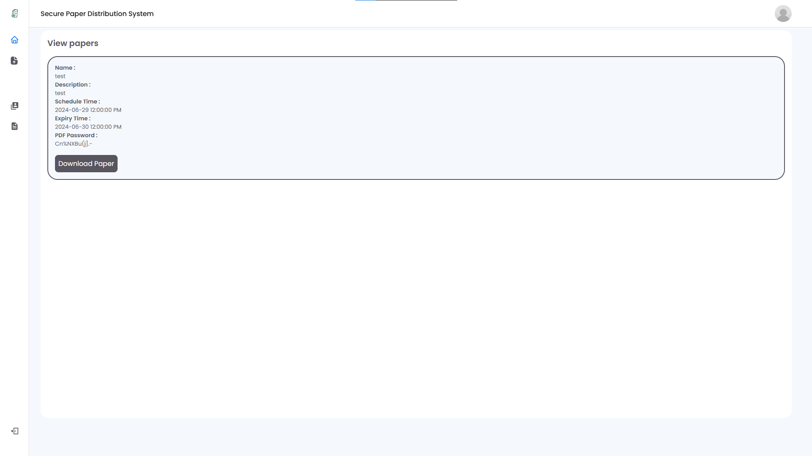

# Secure Examination Paper Distribution System
## odoo combat 2024 Hackathon (Built-in 12 hrs)


This project offers a secure and reliable platform for distributing examination papers, guaranteeing the integrity and confidentiality of exams.

## Key Features

- **Robust User Authentication and Authorization:**
    - Secure login system for administrators, examiners, and invigilators.
    - Role-based access control (RBAC) meticulously restricts access based on user roles, safeguarding data privacy and security.
- **Secure Paper Upload and Management:**
    - Streamlined upload process for administrators and examiners to submit examination papers.
    - Papers are encrypted upon upload to maintain confidentiality.

- **Granular Access Control and Distribution:**
    - Meticulous access control guarantees that only authorized personnel can access specific papers, preventing unauthorized viewing or modification.
    - Scheduled distribution functionality ensures papers are accessible strictly at designated exam times, minimizing the risk of exposure.
    - Comprehensive logging of all access attempts facilitates thorough auditing and examination of activity.
- **Secure Exam Paper Viewing and Download:**
    - Secure interface for authorized users to view and download examination papers.
    - Time-limited access control for downloaded papers restricts access only during the examination period, preventing leaks before or after exams.
  
## Screenshots












## Getting Started

**Prerequisites:**

- (Specify programming languages, libraries, frameworks, or dependencies required.)

**Installation:**

1. Clone the repository:
   ```bash
   git clone https://github.com/Ayushx309/odoo-combat-2024/

2. Install dependencies:
   ```bash
   pip install -r requirements.txt
3. Database Setup:
    - Create a new MySQL database named 'spds' for the project.
    - Import the provided SQL tables provided in [sql](src/sql/) folder of the project.

- **Default Login Credentials (for initial setup only):**

    ```bash
    Username: admin
    Password: admin

## Contributors
- [Ayush Joshi](https://github.com/Ayushx309)
- [Jaymin Gohil](https://github.com/x0tic0p)
- [Tushar Khatri](https://github.com/Simplifier9)
- [Harmit Kalal ](https://github.com/Harmitx7)

## Communication

If you need support for this Project &  want to chat with other devs join the [Pain's Hub](https://discord.gg/QFgahb9Ges) Discord srever.

[](https://discord.gg/VfWQ7YcD6Q) 
